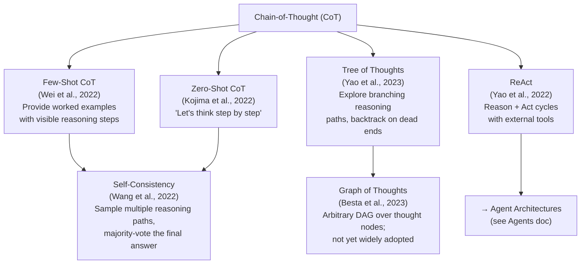

# Chain-of-Thought & Reasoning

---

## 1. Big Picture

**Chain-of-Thought (CoT) prompting** is a technique that asks a language model to produce intermediate reasoning steps — "thinking out loud" — before giving a final answer. Instead of jumping directly from question to answer, the model narrates its logic, which typically leads to more accurate results on tasks that require multi-step reasoning.

**Why it matters**: Language models are trained to predict likely next tokens, not to plan and verify. CoT sidesteps this by turning reasoning into an explicit, visible generation task. The model's own generated steps become additional context it can condition on, making errors easier to spot and correcting earlier mistakes before they compound.

**Scope of this page**: CoT and its close variants (zero-shot CoT, self-consistency, tree-of-thought, and related techniques). This page does **not** re-document prompt engineering broadly, RAG, or agent architectures — see the sibling topics below for those:

- [Agents](./agents.md) — autonomous systems that use CoT-style reasoning as a planning step
- [Retrieval-Augmented Generation (RAG)](./retrieval_augmented_generation.md) — grounding generation with external knowledge
- [Large Language Models (LLM)](./large_language_models.md) — model architecture and scaling context
- [RLHF](./rlhf.md) — aligning model behavior, including alignment of reasoning chains

---

## 2. Visual Map

### How the CoT variants relate



### Variant comparison

| Technique | Prompt overhead | Sampling overhead | Best for | Key weakness |
|---|---|---|---|---|
| **Standard (no CoT)** | None | 1 call | Simple lookups, classification | Poor on multi-step reasoning |
| **Few-Shot CoT** | High (examples in prompt) | 1 call | Arithmetic, symbolic, commonsense | Needs curated exemplars; brittle to example quality |
| **Zero-Shot CoT** | Minimal (magic phrase) | 1 call | Quick boost without labeling | Less accurate than few-shot CoT |
| **Self-Consistency** | Low–moderate | N calls (e.g., 10–40) | High-stakes answers where accuracy > cost | Cost scales linearly with samples |
| **Tree of Thoughts** | Moderate | Many calls (BFS/DFS) | Puzzles, planning, strategic problems | Expensive; complex to orchestrate |
| **ReAct** | Moderate | Per-step calls | Tool-using agents, lookup tasks | Latency per step; loop risk |
| **Least-to-Most** | Moderate | N sub-calls | Compositional / hierarchical problems | Overhead when sub-problems are independent |

---

## 3. Core Mental Model

**Five key ideas:**

1. **Reasoning as generation** — The model produces reasoning text the same way it produces any text. Writing steps down gives the model more context to condition on for the next step.
2. **Compute allocation** — More tokens = more compute. CoT trades token budget for reasoning depth, which is why the gains are most visible on models large enough to produce coherent intermediate steps (roughly ≥10B parameters for few-shot CoT; smaller models can still benefit from zero-shot CoT with instruction tuning).
3. **Faithfulness is not guaranteed** — A fluent, plausible-looking chain of reasoning can lead to a wrong answer. The chain is a generation, not a proof. This is the central trap.
4. **Diversity helps** — Self-consistency exploits the fact that many independent paths to the same answer increases confidence in that answer. Wrong reasoning paths tend to disagree with each other; correct paths tend to converge.
5. **Structure controls search** — Tree-of-Thought and Graph-of-Thought treat reasoning as search over a space of thoughts. They are powerful for problems where the right answer requires backtracking, but they require an explicit search algorithm and evaluation function.

**Memorable intuition**: CoT is like asking someone to show their work on a math test. Showing work doesn't guarantee the answer is right, but it catches arithmetic slips early, makes partial credit possible, and gives the teacher (or the next sampling step) something to verify.

---

## 4. How It Works

### The prompt pattern

**Few-shot CoT** prepends worked examples with explicit intermediate steps:

```
Q: Roger has 5 tennis balls. He buys 2 more cans of 3 balls each.
   How many tennis balls does he have now?
A: Roger starts with 5 balls. 2 cans × 3 balls = 6 new balls. 5 + 6 = 11.
   The answer is 11.

Q: A juggler has 16 balls. Half are golf balls. Half of the golf balls are blue.
   How many blue golf balls are there?
A:
```

The model now has a template: decompose the problem, compute step-by-step, state the answer.

**Zero-shot CoT** skips the examples and instead appends a trigger phrase:

```
Q: A juggler has 16 balls. Half are golf balls. Half of the golf balls are blue.
   How many blue golf balls are there?
A: Let's think step by step.
```

Kojima et al. (2022) found this single phrase substantially improves accuracy — likely because instruction-tuned models have seen CoT outputs in training and the phrase acts as a retrieval cue.

### Reasoning flow

```
Input question
      │
      ▼
[Prompt template + exemplars (few-shot) OR trigger phrase (zero-shot)]
      │
      ▼
Model generates reasoning trace:
  Step 1 → Step 2 → ... → Step N → Final answer
      │
      ▼
Extract final answer from generation
```

With **self-consistency**, this flow runs N times with temperature > 0, then the most frequent final answer is selected.

With **tree-of-thought**, the model generates multiple candidate next-thoughts at each step. A value function (heuristic or another LLM call) evaluates each candidate, and beam search or BFS/DFS selects the path to expand.

### Variant walkthroughs

**Self-consistency**: Sample the model 10–40 times at temperature ≈ 0.7. Extract the final answer from each sample. Take the majority vote. No change to the base prompt required. On GSM8K (grade-school math), Wang et al. (2022) showed +17% accuracy over single-sample CoT.

**Least-to-Most**: Decompose the problem ("What sub-questions do I need to answer first?"), solve each sub-question in order, then use those answers in the full solution. Useful for compositional problems where part of the answer depends on an earlier part.

**ReAct**: Interleave reasoning ("Thought: I need to find the population of Paris") with action calls ("Action: Search[Paris population]") and observations ("Observation: 2.1 million"). The model then reasons again. This is the bridge from CoT to agent architectures.

---

## 5. Why Engineers Reach For It

### Best-fit scenarios

- **Multi-step math and logic**: CoT is reliably helpful when a correct answer requires >1 non-trivial computation or inference step.
- **Structured decomposition**: Planning tasks, code debugging, and schema transformations benefit from explicit sub-step articulation.
- **High-stakes one-shot answers**: Self-consistency reduces variance at the cost of multiple calls — worth it when wrong answers are costly.
- **Interpretability requirements**: A visible reasoning chain is auditable, even if not provably faithful.

### Trade-offs

| Dimension | Impact |
|---|---|
| **Accuracy** | Gains of 5–30% on multi-step reasoning benchmarks vs. standard prompting; less benefit on simple factual lookups |
| **Latency** | CoT generates more tokens → higher time-to-first-byte and generation time. Self-consistency multiplies latency by N. Tree-of-Thought can be 10–100× standard latency. |
| **Cost** | Proportional to output token count × number of calls. Self-consistency with N=20 costs roughly 20× the token spend of a single call. |
| **Reliability** | Reasoning chains can amplify model overconfidence. A wrong intermediate step rarely self-corrects without external feedback. |
| **Observability** | Intermediate steps are visible and loggable — a genuine advantage for debugging and for LLM evaluation pipelines. |

### Interaction with retrieval, tools, and model limits

- **RAG + CoT**: Inject retrieved documents before the reasoning prompt. CoT helps the model reason over multi-document contexts. Watch for the model "reasoning away" from retrieved facts toward memorized ones.
- **Tool use**: CoT steps can precede tool calls, improving tool selection accuracy. ReAct formalizes this pattern.
- **Model size**: Few-shot CoT gains are heavily model-size dependent. Below ~7B parameters, CoT sometimes hurts accuracy because small models generate incoherent chains that mislead rather than guide. Zero-shot CoT with instruction-tuned small models is more reliable.
- **Already easy tasks**: Adding CoT to tasks a model solves directly (e.g., single-hop factual recall) adds tokens without benefit and can introduce errors.

---

## 6. Failure Modes and Pitfalls

### Unfaithful reasoning

The most important pitfall: **the chain of thought may not reflect the model's actual computation**. The model can produce a plausible-sounding, step-by-step narration while the actual prediction comes from pattern matching in weights. Turpin et al. (2023) showed that adding biasing features to prompts caused models to change answers while producing post-hoc reasoning that justified the biased answer. Do not treat CoT as a reliable explanation of why a model answered the way it did.

### Error propagation

A single wrong step early in the chain typically carries forward. Unlike a human who can notice "wait, that doesn't add up," the model does not have a built-in consistency checker. Errors compound.

**Mitigation**: Self-consistency (vote across many paths) reduces error propagation because wrong paths tend to diverge from each other. Explicit verification prompts ("Does this answer satisfy the original constraints?") can catch some errors.

### Prompt sensitivity

CoT accuracy is surprisingly fragile to:
- **Exemplar quality**: Poorly written few-shot examples degrade accuracy substantially. The model learns reasoning style from exemplars — bad reasoning style = bad output.
- **Exemplar order**: The last few examples in a prompt have disproportionate influence.
- **Trigger phrase wording**: Small rewording of zero-shot triggers changes accuracy.
- **Task framing**: Equivalent problems phrased differently can produce very different reasoning paths.

### When CoT hurts

- **Small models** (< ~7B) without reasoning-specific fine-tuning: generated steps are often incoherent and mislead.
- **Simple classification**: CoT adds overhead; the model is already reliable with direct answering.
- **Latency-constrained paths**: If p99 latency is your primary constraint, CoT and especially self-consistency may be architecturally incompatible with your requirements.
- **Overconfident wrong reasoning**: Coherent-looking but wrong chains can mislead both the model's own next step and human reviewers.

### Sycophancy and leading prompts

If the prompt implies an expected answer (e.g., "Isn't it true that...?"), the model may generate reasoning that reverse-engineers support for that answer. Always check that exemplars are neutral and that your prompts do not telegraph the desired outcome.

---

## 7. Engineering Lessons

### The right question to ask first

> Does this task require sequential, dependent steps to solve correctly?

If yes, CoT is worth trying. If no, skip it — you are paying token cost for zero or negative benefit.

### Design the reasoning chain before writing the prompt

Sketch the ideal reasoning trace for 2–3 representative examples before writing prompt code. This reveals whether the task genuinely decomposes step-by-step or whether you are forcing an artificial structure. Strong few-shot exemplars come from this process.

### Treat the chain as a debugging artifact

Log reasoning chains in production. They are your best signal for diagnosing unexpected model behavior. A model that consistently misreads a particular input type will show you that in its reasoning chain before you see it in evaluation metrics.

### Self-consistency is the practical upgrade path

If single-sample CoT is not accurate enough, try self-consistency (N=10–20) before investing in more complex orchestration. It is simple to implement, well-validated, and its accuracy-cost tradeoff is transparent.

### Reserve tree-of-thought for structured search problems

ToT adds significant complexity (search algorithm, evaluation function, state management). It pays off for genuine planning and puzzle-solving tasks. Do not reach for it to compensate for a weak base prompt on simpler tasks.

### Verify, don't just inspect

Build an evaluation pipeline that checks final answers against ground truth or a rubric — not one that only reads reasoning chains. Plausible-sounding reasoning is not a proxy for correct answers.

### Know your model's CoT threshold

Test CoT versus direct prompting on your actual task with your actual model. On instruction-tuned models <7B, zero-shot CoT is often safe and useful; few-shot CoT with poorly chosen exemplars on a small model can degrade performance. Empirical testing on representative samples takes an afternoon and prevents weeks of debugging.

---

## 8. Selected References and Next Steps

### Primary papers

| Reference | Why it matters |
|---|---|
| Wei et al. (2022). **Chain-of-Thought Prompting Elicits Reasoning in Large Language Models.** NeurIPS 2022. [[PDF]](https://arxiv.org/abs/2201.11903) | The foundational few-shot CoT paper. Introduces the technique, demonstrates gains on arithmetic, commonsense, and symbolic tasks, and establishes the model-size threshold. Start here. |
| Kojima et al. (2022). **Large Language Models are Zero-Shot Reasoners.** NeurIPS 2022. [[PDF]](https://arxiv.org/abs/2205.11916) | Introduces zero-shot CoT ("Let's think step by step"). Practical because it requires no exemplars and works surprisingly well on instruction-tuned models. |
| Wang et al. (2022). **Self-Consistency Improves Chain of Thought Reasoning in Language Models.** ICLR 2023. [[PDF]](https://arxiv.org/abs/2203.11171) | Introduces self-consistency via majority voting. The simplest and most widely adopted CoT enhancement. Essential for production use cases where accuracy matters more than single-call cost. |
| Yao et al. (2023). **Tree of Thoughts: Deliberate Problem Solving with Large Language Models.** NeurIPS 2023. [[PDF]](https://arxiv.org/abs/2305.10601) | Formalizes reasoning as search over a tree of thoughts. Important conceptual extension; useful for planning and multi-step puzzle tasks. Read after the core three papers above. |
| Yao et al. (2022). **ReAct: Synergizing Reasoning and Acting in Language Models.** ICLR 2023. [[PDF]](https://arxiv.org/abs/2210.03629) | Bridges CoT and tool-using agents. Directly motivates agent architectures. Required reading before implementing LLM agents. |
| Turpin et al. (2023). **Language Models Don't Always Say What They Think: Unfaithful Explanations in Chain-of-Thought Prompting.** NeurIPS 2023. [[PDF]](https://arxiv.org/abs/2305.04388) | The most important cautionary paper. Shows that CoT chains can be post-hoc rationalization rather than faithful explanation. Read this to avoid over-trusting visible reasoning. |

### Follow-up study path

1. **Run the experiment** — The [`cot-prompt-comparator`](../../research-paper-projects/cot-prompt-comparator/) project in this repository lets you empirically compare standard, CoT, concise-CoT, and verbose-CoT prompts on arithmetic, symbolic, and commonsense tasks.
2. **Try self-consistency** — Modify the comparator to sample N=10 responses and take the majority vote. Measure the accuracy-cost tradeoff on the same task set.
3. **Stress-test faithfulness** — Prompt the model with a problem where you know the correct answer is counter-intuitive. Does the reasoning chain lead there, or does it rationalize the intuitive wrong answer?
4. **Read the ReAct paper** and connect it to the [Agents doc](./agents.md) — understanding how CoT reasoning steps interleave with tool calls is essential for building LLM-powered workflows.
5. **Benchmark your model** — Run few-shot CoT vs. zero-shot CoT vs. direct on 20–50 representative examples from your actual use case. Results vary significantly across tasks and models.
