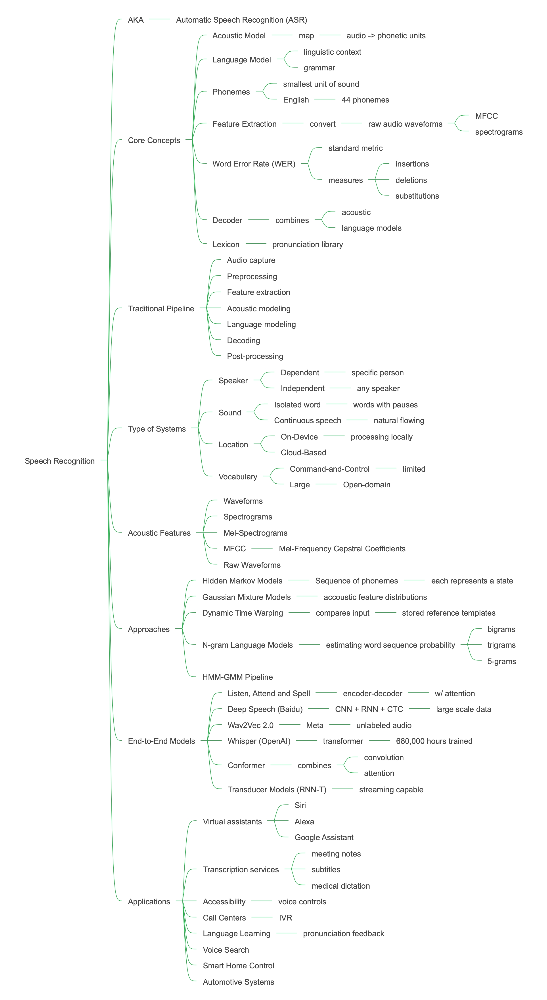

# Speech Recognition (ASR)

---

## 1. Overview

**Speech Recognition** (also known as **Automatic Speech Recognition** or **ASR**) is a subfield of artificial intelligence and computational linguistics concerned with converting spoken language into text. Instead of learning from explicit input-output pairs in a traditional sense, ASR systems learn to map **acoustic signals** to **linguistic representations**.

The core idea is simple:

* Audio is captured and preprocessed into acoustic features
* A model analyzes these features to identify phonemes, words, or characters
* The output is transcribed text representing what was spoken

ASR is particularly well-suited for problems involving **human-computer interaction**, **accessibility**, and **content transcription**.

---

## 2. Core Concepts

### Acoustic Model

Maps audio features to phonetic units. Estimates the probability of observing acoustic features given a sequence of phonemes or words.

### Language Model

Provides linguistic context and grammar. Estimates the probability of word sequences, helping disambiguate similar-sounding words.

### Phonemes

The smallest units of sound in a language. English has approximately 44 phonemes.

### Feature Extraction

Converting raw audio waveforms into meaningful representations like MFCCs or spectrograms.

### Word Error Rate (WER)

The standard metric for ASR accuracy. Measures insertions, deletions, and substitutions relative to ground truth.

### Decoder

Combines acoustic and language models to find the most likely text sequence given the audio input.

### Lexicon (Pronunciation Dictionary)

Maps words to their phonetic pronunciations.

---

## 3. Traditional Speech Recognition Pipeline

1. **Audio Capture**: Record audio signal (typically 16kHz sampling rate)
2. **Preprocessing**: Noise reduction, normalization
3. **Feature Extraction**: Convert to MFCCs, filter banks, or spectrograms
4. **Acoustic Modeling**: HMM-GMM or DNN predicts phoneme probabilities
5. **Language Modeling**: Apply n-gram or neural language model
6. **Decoding**: Search for optimal word sequence (Viterbi algorithm)
7. **Post-processing**: Capitalization, punctuation, formatting

This pipeline dominated ASR from the 1980s through early 2010s.

---

## 4. Types of Systems

### Speaker-Dependent vs Speaker-Independent

* **Speaker-Dependent**: Trained for a specific person (higher accuracy, limited use)
* **Speaker-Independent**: Works for any speaker (most modern systems)

### Isolated Word vs Continuous Speech

* **Isolated Word**: Recognizes single words spoken with pauses
* **Continuous Speech**: Handles natural flowing speech (more complex)

### On-Device vs Cloud-Based

* **On-Device**: Processing happens locally (privacy, latency)
* **Cloud-Based**: Uses server resources (better accuracy, requires internet)

### Command-and-Control vs Large Vocabulary

* **Command-and-Control**: Limited vocabulary (e.g., voice commands)
* **Large Vocabulary**: Open-domain transcription (dictation, meetings)

---

## 5. Simple Example (Intuition)

**Wake Word Detection**:

* Audio: continuous microphone input
* Task: detect "Hey Assistant" in real-time
* Features: mel-spectrogram of rolling 2-second window
* Model: small CNN predicts "wake word" vs "background"

The system continuously processes audio. When the model's confidence exceeds a threshold, the device activates.

**Key insight**: The model learns acoustic patterns without explicit phonetic decomposition—an end-to-end approach.

---

## 6. Acoustic Features

### Waveforms

Raw audio signal: amplitude over time. High-dimensional and noisy.

### Spectrograms

Frequency content over time. Obtained via Short-Time Fourier Transform (STFT). Visual representation shows energy across frequencies.

### Mel-Spectrograms

Spectrograms with mel-scale frequency axis (mimics human hearing). Compresses high frequencies and expands low frequencies.

### MFCCs (Mel-Frequency Cepstral Coefficients)

The most common traditional feature. Represents the "shape" of the spectral envelope. Typically 13-39 coefficients per frame.

### Raw Waveforms

Modern end-to-end models (Wav2Vec 2.0) can learn directly from raw audio, eliminating hand-crafted features.

---

## 7. Traditional Approaches

### Hidden Markov Models (HMMs)

Model temporal sequence of phonemes. Each phoneme is represented as a sequence of states.

### Gaussian Mixture Models (GMMs)

Used within HMM states to model acoustic feature distributions.

### Dynamic Time Warping (DTW)

Early template-matching approach. Compares input to stored reference templates.

### N-gram Language Models

Statistical models estimating word sequence probabilities (bigrams, trigrams, 5-grams).

### HMM-GMM Pipeline

The dominant approach from 1990s–2010. Combined HMMs for temporal modeling with GMMs for acoustic modeling.

---

## 8. Deep Learning in ASR

**Deep Learning** revolutionized ASR starting in the early 2010s.

Key innovations:

* **DNNs replace GMMs**: Deep Neural Networks model acoustic features more effectively
* **RNNs / LSTMs**: Capture temporal dependencies better than HMMs
* **CTC (Connectionist Temporal Classification)**: Enables end-to-end training without phoneme alignment
* **Attention Mechanisms**: Allow models to focus on relevant audio segments
* **Transformers**: Parallelizable architecture for sequence modeling

Neural networks learn:

* Acoustic feature representations
* Phoneme and word probabilities
* Implicit language models

This enables ASR to scale to diverse accents, languages, and acoustic conditions.

---

## 9. Modern End-to-End Models

### Listen, Attend and Spell (LAS)

Encoder-decoder with attention. Directly outputs characters or words from audio.

### Deep Speech (Baidu)

Simple architecture: CNNs + RNNs + CTC. Demonstrated power of large-scale data.

### Wav2Vec 2.0 (Facebook/Meta)

Self-supervised pre-training on unlabeled audio. Fine-tunes with small labeled datasets. State-of-the-art for low-resource languages.

### Whisper (OpenAI)

Transformer trained on 680,000 hours of multilingual data. Robust to accents, noise, and technical language. Zero-shot capabilities.

### Conformer

Combines convolution and attention for optimal local and global modeling. Used in Google's production systems.

### Transducer Models (RNN-T)

Streaming-capable end-to-end models. Popular for real-time applications.

---

## 10. Common Applications

* **Virtual Assistants**: Siri, Alexa, Google Assistant
* **Transcription Services**: Meeting notes, subtitles, medical dictation
* **Accessibility**: Voice control for users with disabilities
* **Call Centers**: Automated customer service and analytics
* **Language Learning**: Pronunciation feedback
* **Voice Search**: Hands-free web and app queries
* **Smart Home Control**: Voice-activated devices
* **Automotive Systems**: In-car voice commands

ASR is especially powerful where **hands-free interaction** or **real-time transcription** is needed.

---

## 11. Key Research Papers

### Foundational Papers

* **Speech Recognition by Machine** — Acoustic-phonetic approach (1950s)

* **A Maximum Likelihood Approach to Continuous Speech Recognition** — HMMs in ASR (1983)

### Deep Learning Era

* **Acoustic Modeling using Deep Belief Networks** — Hinton et al. (2012)

* **Deep Neural Networks for Acoustic Modeling in Speech Recognition** — Dahl et al. (2012)

* **Connectionist Temporal Classification** — Graves et al. (2006)

### Modern End-to-End Systems

* **Listen, Attend and Spell** — Chan et al. (2016)

* **Deep Speech: Scaling up end-to-end speech recognition** — Hannun et al. (2014)

* **wav2vec 2.0: A Framework for Self-Supervised Learning of Speech Representations** — Baevski et al. (2020)

* **Robust Speech Recognition via Large-Scale Weak Supervision** — Whisper paper, Radford et al. (2022)

* **Conformer: Convolution-augmented Transformer for Speech Recognition** — Gulati et al. (2020)

---

## 12. Learning Resources (Free & High Quality)

### Courses

* **Stanford CS224S – Spoken Language Processing**

* **CMU 11-751 – Speech Recognition and Understanding**

* **Coursera – Sequence Models (includes speech content)**

### Tutorials & Guides

* **Speech and Language Processing** — Jurafsky & Martin (Chapter on ASR)

* **Hugging Face ASR Course**

* **Fast.ai Practical Deep Learning** — includes audio processing

### Libraries & Tooling

* **Whisper (OpenAI)** — State-of-the-art pre-trained model

* **Wav2Vec 2.0 (Hugging Face Transformers)** — Fine-tunable pre-trained models

* **Kaldi** — Traditional ASR toolkit (HMM-based)

* **ESPnet** — End-to-end speech processing toolkit

* **SpeechBrain** — PyTorch-based modern ASR toolkit

* **DeepSpeech (Mozilla)** — Open-source end-to-end ASR

* **pyAudioAnalysis** — Feature extraction and audio processing

---

## 13. Practical Advice for Learning ASR

1. Start with **audio visualization** before modeling
2. Understand MFCCs and spectrograms deeply
3. Use pre-trained models (Whisper, Wav2Vec) before training from scratch
4. Experiment with different audio preprocessing techniques
5. Measure WER, not just training loss
6. Test on diverse speakers, accents, and noise conditions
7. Learn about audio sampling rates and their impact
8. Study the difference between streaming and batch processing

---

## 14. Common Pitfalls

* **Ignoring audio quality**: Noise and sampling rate greatly affect performance
* **Overfitting to clean speech**: Real-world audio is messy
* **Neglecting language model**: Acoustic model alone is insufficient
* **Wrong evaluation metrics**: WER on test set may not reflect real-world performance
* **Not handling silence and background noise**: Model must distinguish speech from non-speech
* **Ignoring real-time constraints**: Streaming vs batch has different requirements
* **Accent and dialect bias**: Models trained on limited demographics perform poorly on others

---

## 15. Connection to Modern AI

* **Multimodal Models**: Speech + vision + text (e.g., GPT-4 with voice)
* **Voice Assistants + LLMs**: ASR feeds transcription to language models for understanding
* **Speech-to-Speech Translation**: ASR → MT → TTS pipeline
* **Emotion and Sentiment Analysis**: Beyond words, analyzing tone and prosody
* **Self-Supervised Learning**: Wav2Vec 2.0 approach influencing broader AI
* **Continual Learning**: Adapting ASR to new speakers and domains without forgetting

ASR is a critical component of **natural human-AI interaction** and increasingly integrated with large language models.

---

## 16. Suggested Next Steps (Hands-on Mini Projects)

Each step is intentionally small and self-contained. These can each live in their own folder or repository.

### Project 1: Audio Visualization

**Goal:** Build intuition for audio signals and their representations.

* Load a .wav file (use librosa)
* Plot waveform, spectrogram, and mel-spectrogram
* Visualize the difference between speech and silence
* Output: saved plots comparing different representations

### Project 2: MFCC Feature Extraction

**Goal:** Understand traditional ASR features.

* Implement MFCC extraction (or use librosa)
* Compare features from different speakers
* Visualize MFCC coefficients over time
* Experiment with different frame sizes and hop lengths

### Project 3: Wake Word Detector

**Goal:** Build a simple keyword spotter.

* Collect 50 samples of a target word (e.g., "start")
* Extract mel-spectrograms
* Train a small CNN classifier (target word vs background)
* Test on live microphone input

### Project 4: Whisper Transcription Tool

**Goal:** Use state-of-the-art pre-trained ASR.

* Install Whisper (OpenAI)
* Build a CLI tool to transcribe audio files
* Compare different model sizes (tiny, base, medium)
* Measure WER on a small test set
* Add timestamp output for subtitles

### Project 5: Custom Fine-Tuning with Wav2Vec 2.0

**Goal:** Adapt a pre-trained model to new data.

* Use Hugging Face datasets (Common Voice or LibriSpeech subset)
* Fine-tune a small Wav2Vec 2.0 model
* Compare performance before and after fine-tuning
* Experiment with different learning rates and data sizes

### Project 6: Accent/Noise Robustness Experiment

**Goal:** Understand model limitations and robustness.

* Test Whisper on different accents (collect samples or use datasets)
* Add synthetic noise (white noise, background music)
* Measure WER degradation
* Visualize which phonemes/words are most affected

### Project 7: Build a Simple Voice Command System

**Goal:** End-to-end speech application.

* Define 10 commands (e.g., "turn on lights", "play music")
* Use Whisper for transcription
* Parse commands with simple keyword matching or small NLU model
* Trigger mock actions
* Extend with LLM for natural language understanding

### Project 8: Read-and-Reproduce

**Goal:** Learn by replication.

* Pick one paper (CTC, Listen Attend and Spell, or Deep Speech)
* Reproduce a simplified version on a toy dataset
* Write a short report on what broke and why
* Document differences between paper and implementation

---

*Deep ASR understanding comes from hearing, visualizing, and decoding real audio signals.*

## Generation Metadata

- **Generated with:** GitHub Copilot
- **Model family:** GPT-4
- **Generation role:** Educational documentation
- **Prompt style:** Structured, following reinforcement_learning.md template
- **Human edits:** None
- **Date generated:** 1-8-2026

**Note:** This document follows the structure and style of the existing reinforcement_learning.md documentation to maintain consistency across the AI projects documentation set.
