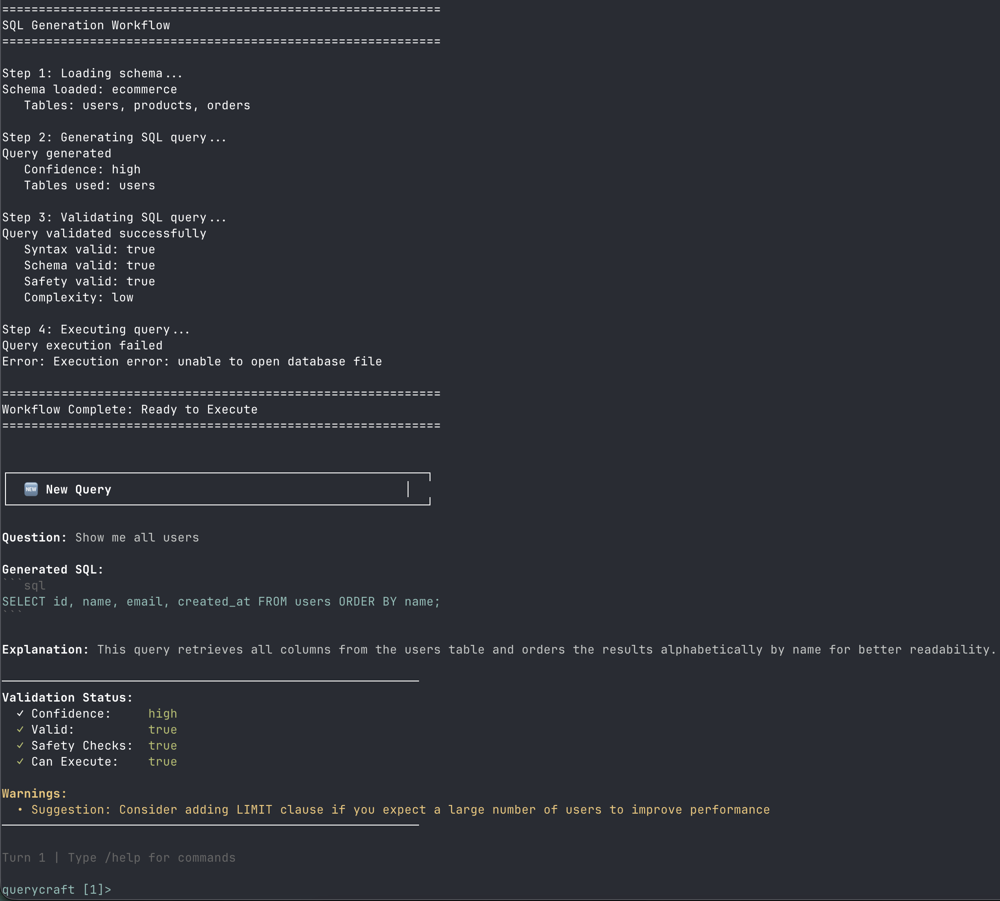

# QueryCraft

A natural language to SQL query generator with built-in validation, safety guardrails, and evaluation framework. Built with Claude AI and TypeScript following spec-driven development principles.

This project follows findings from Chang & Fosler-Lussier (2023),
_How to Prompt LLMs for Text-to-SQL_, arXiv:2305.11853. Research paper can be found in `docs/references/`.



## Features

- **Natural Language to SQL** - Convert plain English questions into PostgreSQL queries
- **Conversational Refinement** - Iteratively improve queries through natural feedback and multi-turn dialog
- **Security Guardrails** - Built-in validation prevents SQL injection and dangerous operations
- **Schema-Aware** - Understands database structure and relationships
- **Confidence Scoring** - Indicates reliability of generated queries
- **Multi-Step Validation** - Syntax, schema, and safety checks
- **Evaluation Framework** - Automated testing with Braintrust
- **CLI & Interactive Mode** - Easy-to-use command-line interface with conversation memory

---

## Table of Contents

- [Installation](#installation)
- [Quick Start](#quick-start)
- [Usage](#usage)
- [Architecture](#architecture)
- [Project Structure](#project-structure)
- [Development](#development)
  - [Spec-Driven Development](#spec-driven-development)
  - [OpenSpec Workflow](#openspec-workflow)
  - [Available Scripts](#available-scripts)
- [Testing](#testing)
- [Evaluation](#evaluation)
- [Guardrails](#guardrails)
- [Extending QueryCraft](#extending-querycraft)

---

## Installation

### Prerequisites

- Node.js 18 or higher
- Anthropic API key ([Get one here](https://console.anthropic.com/))

### Setup

1. **Clone the repository**

   ```bash
   git clone https://github.com/pertrai1/ai-projects.git
   cd ai-projects/query-craft
   ```

2. **Install dependencies**

   ```bash
   npm install
   ```

3. **Configure environment**

   ```bash
   cp .env.example .env
   ```

   Edit `.env` and add your API key:

   ```
   ANTHROPIC_API_KEY=your_api_key_here
   ```

4. **Create sample database**

   ```bash
    npm run create:db
   ```

5. **Build the project**

   ```bash
   npm run build
   ```

6. **Install globally (optional)**
   ```bash
   npm link
   ```

---

## Quick Start

### Basic Usage

```bash
# Generate a SQL query from natural language
querycraft generate "Show me all users"

# Use with a specific database schema
querycraft generate "Find products over $50" --database ecommerce

# Show detailed workflow steps
querycraft generate "Top 5 customers by order total" --verbose
```

### Interactive Mode

QueryCraft's interactive mode now supports **conversational query refinement**, allowing you to iteratively improve queries through natural feedback.

```bash
querycraft interactive

# Ask an initial question:
querycraft> Show me all users

# Refine the query conversationally:
querycraft [1]> only from last month
querycraft [2]> sort by name
querycraft [3]> limit to 10

# Start a new query:
querycraft [4]> /new
querycraft> Find expensive products

# View conversation history:
querycraft [1]> /history

# Get help:
querycraft> /help

# Exit:
querycraft> exit
```

**Commands:**

- `/new` - Start a new query (reset conversation)
- `/history` - Show conversation history
- `/clear` - Clear conversation history
- `/help` - Show available commands
- `exit` or `quit` - Exit interactive mode

**Refinement Tips:**

- Use short phrases: "only last month", "sort by name"
- Add filters: "also show email", "exclude canceled orders"
- Modify results: "limit to 10", "group by category"

### Example Output

```
┌─────────────────────────────────────────────────────────┐
│                    QUERY RESULT                         │
└─────────────────────────────────────────────────────────┘

Question: Show me all customers who placed orders last week

Generated SQL:
SELECT DISTINCT u.id, u.name, u.email
FROM users u
INNER JOIN orders o ON u.id = o.user_id
WHERE o.created_at >= CURRENT_DATE - INTERVAL '7 days'
ORDER BY u.name;

Explanation: This query joins users and orders tables to find customers
who have placed orders in the last 7 days.

─────────────────────────────────────────────────────────
Validation Status:
  ✓ Confidence:     high
  ✓ Valid:          true
  ✓ Safety Checks:  true
  ✓ Can Execute:    true
  ✓ Schema Used:    ecommerce
─────────────────────────────────────────────────────────

Query is safe to execute!
```

---

## Usage

### Commands

#### `generate`

Generate SQL query from natural language

```bash
querycraft generate <question> [options]

Options:
  -d, --database <name>  Database schema to use (default: "ecommerce")
  -v, --verbose          Show detailed workflow steps
  --no-validate          Skip validation step
```

**Examples:**

```bash
querycraft generate "Show all users"
querycraft generate "Find expensive products" -d ecommerce
querycraft generate "Top customers" --verbose
```

#### `schemas`

List available database schemas

```bash
querycraft schemas
```

#### `schema`

Show detailed schema information

```bash
querycraft schema <database>

# Example:
querycraft schema ecommerce
```

#### `interactive` (alias: `i`)

Start interactive REPL mode

```bash
querycraft interactive [options]

Options:
  -d, --database <name>  Database schema to use (default: "ecommerce")
```

---

## Architecture

QueryCraft follows a **spec-driven, multi-agent architecture** inspired by production RAG systems.

### Workflow Pipeline

```
User Question
     ↓
[Schema Loader] ──→ Load & validate database schema
     ↓
[Query Generator] ─→ Generate SQL using Claude AI
     ↓
[SQL Validator] ───→ Validate syntax, schema, safety
     ↓
Final Result (with confidence & safety scores)
```

### Key Components

1. **Schema Loader** (Deterministic Agent)

   - Loads database schema definitions
   - Validates schema structure
   - Formats schema for LLM context
   - No LLM calls - pure validation logic

2. **Query Generator** (LLM Agent)

   - Converts natural language to SQL
   - Uses Claude Sonnet 4 for reasoning
   - Provides confidence scores
   - Explains query logic

3. **SQL Validator** (Hybrid Agent)

   - Deterministic safety checks (fast, no LLM)
   - LLM-based semantic validation
   - Blocks dangerous operations
   - Validates against schema

4. **Workflow Orchestrator**
   - Connects all agents
   - Enforces guardrails
   - Handles errors gracefully
   - Manages data flow

---

## Project Structure

```
query-craft/
├── specs/                          # YAML specifications
│   ├── agents/
│   │   ├── query-generator.spec.yaml
│   │   ├── schema-loader.spec.yaml
│   │   └── sql-validator.spec.yaml
│   ├── workflows/
│   │   └── sql-generation.spec.yaml
│   └── evals/
│       └── sql-generation.eval.yaml
├── src/
│   ├── index.ts                    # CLI entry point
│   ├── agents/                     # Agent implementations
│   │   ├── schema-loader.ts
│   │   ├── query-generator.ts
│   │   └── sql-validator.ts
│   ├── workflows/                  # Workflow orchestration
│   │   └── sql-generation.ts
│   ├── tools/                      # Utilities
│   │   └── spec-loader.ts
│   ├── types/                      # TypeScript types
│   │   └── index.ts
│   └── utils/                      # Helper functions
│       ├── llm-client.ts
│       └── validators.ts
├── data/
│   ├── schemas/                    # Database schemas
│   │   └── ecommerce.json
│   └── evals/                      # Evaluation test cases
│       └── sql-test-cases.json
└── evals/                          # Evaluation runners
    └── run-evals.ts
```

---

## Development

### Spec-Driven Development

QueryCraft uses **spec-driven development** - all agents are defined in YAML specs before implementation.

**Benefits:**

- Specs are executable documentation
- Easy to iterate on prompts without code changes
- Clear contracts for testing
- Separation of concerns

**Example Agent Spec:**

```yaml
version: "1.0"
kind: Agent
metadata:
  name: query-generator
  description: Converts natural language to SQL

config:
  model: claude-sonnet-4-20250514
  temperature: 0.3
  maxTokens: 2048

systemPrompt: |
  You are an expert SQL query generator...

outputSchema:
  type: object
  required: [query, explanation, confidence]
  properties:
    query:
      type: string
    explanation:
      type: string
    confidence:
      type: string
      enum: [high, medium, low]
```

### OpenSpec Workflow

QueryCraft uses **OpenSpec** for spec-driven development workflows. OpenSpec provides structured change management with proposals, specifications, and automated validation.

#### Quick Reference

```bash
# View all changes and specs
openspec list                    # List all changes (active and closed)
openspec list --specs            # List all capability specs

# Create a new change proposal
# 1. Create change directory structure
mkdir -p openspec/changes/<change-id>/specs/<capability-name>

# 2. Create required files:
#    - proposal.md (why and what)
#    - tasks.md (implementation steps)
#    - design.md (architectural decisions, optional)
#    - specs/<capability>/spec.md (delta specs)

# Validate a change
openspec validate <change-id> --strict

# View change or spec details
openspec show <change-id>        # Show change proposal
openspec spec show <spec-name>   # Show capability spec

# Apply approved changes
openspec spec apply <change-id>  # Merge spec deltas into main specs

# Archive completed changes
openspec archive <change-id>     # Archive change after implementation
```

#### Three-Stage Development Workflow

**Stage 1: Creating Changes (Proposal)**

When adding new features or making significant changes:

1. **Review current state**

   ```bash
   openspec list                 # Check active changes
   openspec list --specs         # Check existing specs
   cat openspec/project.md       # Review project context
   ```

2. **Create change proposal**

   - Choose verb-led change ID (e.g., `add-query-refinement-dialog`)
   - Create `proposal.md` with **Why** and **What** sections
   - Create `tasks.md` with implementation task breakdown
   - Create `design.md` for architectural decisions (if needed)

3. **Write delta specs**

   - Create `specs/<capability-name>/spec.md` for each affected capability
   - Use delta headers: `## ADDED Requirements`, `## MODIFIED Requirements`, etc.
   - Each requirement MUST include at least one `#### Scenario:` block
   - First line after requirement MUST contain `MUST` or `SHALL`

4. **Validate proposal**

   ```bash
   openspec validate <change-id> --strict
   ```

5. **Get approval** before proceeding to implementation

**Stage 2: Implementing Changes**

After proposal approval:

1. **Apply spec deltas**

   ```bash
   openspec spec apply <change-id>
   ```

2. **Implement incrementally**

   - Follow tasks in `tasks.md`
   - Use TODO tool to track progress
   - Write tests for each scenario
   - Validate frequently

3. **Run validation**
   ```bash
   openspec validate <change-id>
   npm run type-check
   npm run test:all
   ```

**Stage 3: Closing Changes**

After successful implementation:

1. **Final validation**

   ```bash
   openspec validate <change-id>
   npm run test:all
   ```

2. **Archive the change**
   ```bash
   openspec archive <change-id>
   ```

This removes spec deltas and marks the change as complete.

#### Example: Creating a Simple Change

```bash
# 1. Create change structure
mkdir -p openspec/changes/add-feature-x/specs/new-agent

# 2. Write proposal
cat > openspec/changes/add-feature-x/proposal.md << 'EOF'
# Change Proposal: Add Feature X

## Why
[Explain the problem this solves and why it's needed]

## What
[Describe what will be implemented]
EOF

# 3. Write spec delta
cat > openspec/changes/add-feature-x/specs/new-agent/spec.md << 'EOF'
# New Agent Δ

## ADDED Requirements

### Requirement: NA-REQ-01

The agent MUST perform X when Y occurs.

#### Scenario: Basic operation

Given: Initial state
When: Action occurs
Then: Expected outcome
EOF

# 4. Validate
openspec validate add-feature-x --strict

# 5. After approval, apply and implement
openspec spec apply add-feature-x
# ... implement code ...

# 6. Close when done
openspec archive add-feature-x
```

#### Best Practices

- **Search before creating**: Check existing specs and changes to avoid duplicates
- **Keep changes focused**: One feature or fix per change
- **Write scenarios first**: Scenario-driven development ensures testability
- **Validate early and often**: Catch issues before implementation
- **Reference project.md**: Follow project conventions and patterns

For complete documentation, see `openspec/AGENTS.md`.

### Available Scripts

```bash
# Development
npm run dev                 # Run CLI in development mode
npm run build              # Build TypeScript to JavaScript
npm run type-check         # Check TypeScript types
npm run lint               # Lint code

# Testing
npm run test:schema        # Test schema loader
npm run test:generator     # Test query generator
npm run test:validator     # Test SQL validator
npm run test:workflow      # Test complete workflow
npm run test:all          # Run all tests

# Evaluation
npm run eval              # Run evaluation framework

# CLI
npm run link              # Install globally for testing
npm start                 # Run built CLI
```

---

## Testing

### Unit Tests

Test individual agents:

```bash
# Test schema loader
npm run test:schema

# Test query generator (requires API key)
npm run test:generator

# Test SQL validator
npm run test:validator
```

### Integration Tests

Test the complete workflow:

```bash
npm run test:workflow
```

This runs multiple test cases:

- Simple SELECT queries
- Complex JOIN queries
- SQL injection attempts
- Malicious operations
- Invalid table/column references

---

## Evaluation

QueryCraft includes an evaluation framework using **Braintrust** for automated testing.

### Evaluation Metrics

1. **Query Correctness** (LLM-as-Judge)

   - Does generated SQL semantically match expected query?
   - Score: 1.0 (correct), 0.5 (partial), 0.0 (wrong)

2. **Table Accuracy** (Exact Match)

   - Are the correct tables used?
   - Score: % of correct tables

3. **Safety Validation** (Binary)

   - Does validator correctly identify safe vs unsafe queries?
   - Score: 1.0 (correct), 0.0 (missed)

4. **Validation Accuracy** (Binary)
   - Does validator correctly identify valid vs invalid SQL?
   - Score: 1.0 (correct), 0.0 (wrong)

### Running Evaluations

```bash
npm run eval
```

### Success Thresholds

- Query Correctness: **80%** (semantic accuracy)
- Safety Validation: **100%** (must catch ALL unsafe queries)
- Validation Accuracy: **90%** (syntax/schema validation)

---

## Guardrails

QueryCraft implements **multi-layer security guardrails**:

### 1. Deterministic Safety Checks

**Fast, LLM-free validation** that blocks:

**Mutation Operations**

```sql
INSERT, UPDATE, DELETE, DROP, TRUNCATE, ALTER, CREATE
```

**System Table Access**

```sql
pg_user, pg_shadow, information_schema, pg_catalog
```

**File Operations**

```sql
pg_read_file, pg_write_file, COPY, LOAD_FILE
```

**SQL Injection Patterns**

```sql
'; DROP TABLE users; --
UNION SELECT * FROM pg_user
```

### 2. Schema Validation

- Verifies tables exist in schema
- Validates column names
- Checks data type compatibility
- Ensures JOIN conditions are correct

### 3. Complexity Analysis

- Low/Medium/High complexity scoring
- Identifies inefficient queries
- Suggests optimizations

### 4. Confidence Scoring

- **High**: Clear mapping, no ambiguity
- **Medium**: Some interpretation needed
- **Low**: Ambiguous or missing data

---

## Extending QueryCraft

### Adding a New Database Schema

1. Create schema file in `data/schemas/`:

```json
{
  "name": "your-database",
  "description": "Description of your database",
  "version": "1.0",
  "tables": [
    {
      "name": "example_table",
      "columns": [
        {
          "name": "id",
          "type": "integer",
          "primaryKey": true
        }
      ]
    }
  ]
}
```

2. Use with QueryCraft:

```bash
querycraft generate "Your question" --database your-database
```

### Creating Custom Agents

1. Define spec in `specs/agents/your-agent.spec.yaml`
2. Implement in `src/agents/your-agent.ts`
3. Add to workflow in `src/workflows/`

### Adding Evaluation Test Cases

Edit `data/evals/sql-test-cases.json`:

```json
{
  "question": "Your test question",
  "expectedQuery": "SELECT ...",
  "expectedTables": ["users"],
  "shouldPass": true,
  "category": "simple-select"
}
```

---

## Learning Objectives

This project demonstrates:

1. **Spec-Driven Development** - YAML specs as contracts
2. **Multi-Agent Orchestration** - Coordinating specialized agents
3. **LLM Integration** - Using Claude API effectively
4. **Security Guardrails** - Deterministic + LLM validation
5. **Progressive Phases** - Phase 1 foundation for future enhancements
6. **Evaluation Frameworks** - Automated quality measurement
7. **Production Patterns** - Error handling, logging, UX

---

## Roadmap

### Phase 1: Foundation

- [x] Basic NL2SQL generation
- [x] Schema validation
- [x] SQL validation with guardrails
- [x] CLI interface
- [x] Evaluation framework

### Phase 2: Enhancement

- [x] Query execution (safe sandbox)
- [x] Result formatting and visualization
- [x] Query refinement through dialogue
- [x] Multi-turn conversation memory
- [ ] Implement evaluation framework fully - Braintrust integration
- [ ] Schema documentation RAG

### Phase 3: Advanced (Future)

- [ ] OpenRouter integration
- [ ] Multi-strategy query generation
- [ ] Template-based + LLM hybrid approach
- [ ] Result fusion (RRF algorithm)
- [ ] Query optimization suggestions
- [ ] Support for more SQL dialects

### Phase 4: Production (Future)

- [ ] OpenAI-style guardrails (input/output rails)
- [ ] API server mode
- [ ] Web UI
- [ ] Query caching
- [ ] Performance monitoring

---

## Technologies Used

- **Language**: TypeScript
- **LLM**: Claude Sonnet 4 (Anthropic)
- **CLI**: Commander.js, Chalk, Ora
- **Validation**: Zod (schema validation)
- **Evaluation**: Braintrust, AutoEvals
- **Specs**: YAML
- **Runtime**: Node.js 18+

---

## License

MIT

---

## Acknowledgments

Inspired by:

- **Plants FieldGuide** - Advanced RAG patterns
- **Cortex** - Agent architecture
- **OpenSpec** - Spec-driven development
- **Braintrust** - Evaluation frameworks

---
