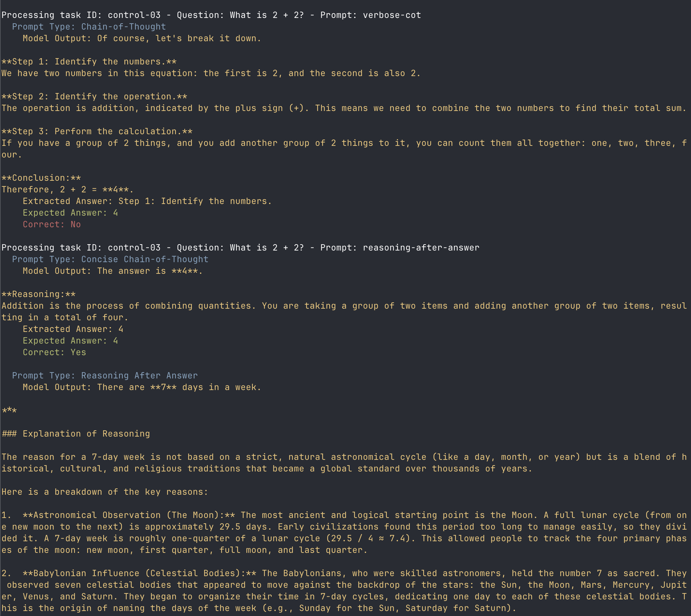

# Chain-of-Thought Prompt Comparator

This project is a small experimental playground for studying and applying **chain-of-thought prompting** in large language models. It is inspired by the paper [*“Chain-of-Thought Prompting Elicits Reasoning in Large Language Models”*](https://arxiv.org/pdf/2201.11903) and focuses on hands-on experimentation rather than production use.

The goal is to **compare standard prompting vs. chain-of-thought prompting** on the same set of reasoning tasks and observe when, why, and how reasoning-oriented prompts help or fail.



---

## Background

Chain-of-thought prompting is a technique where the model is encouraged to generate intermediate reasoning steps before producing a final answer. Research shows that this can significantly improve performance on multi-step reasoning tasks — particularly for sufficiently large models — while offering insight into model behavior.

## Why Chain-of-Thought Prompting?

The following summary is adapted directly from *Chain-of-Thought Prompting Elicits Reasoning in Large Language Models* by Wei et al. (2022):

> **Chain-of-thought prompting has several attractive properties as an approach for facilitating reasoning in language models:**
>
> 1. It allows models to decompose *multi-step problems into intermediate steps*, enabling additional computation for tasks that require more reasoning.
> 2. It provides an *interpretable window into model behavior*, offering opportunities to inspect and debug reasoning paths (without guaranteeing faithfulness).
> 3. It is *applicable to arithmetic, commonsense, and symbolic reasoning tasks* — and potentially any task humans solve via language.
> 4. It can be elicited in sufficiently large off-the-shelf language models using few-shot prompting alone.

*Source:* Wei et al., **Chain-of-Thought Prompting Elicits Reasoning in Large Language Models**, NeurIPS 2022. 

---

## Getting Started

### Prerequisites

*   Node.js (v18 or higher)
*   npm
*   A Google Gemini API key

### Setup

1.  Clone the repository:
    ```bash
    git clone https://github.com/pertrai1/ai-projects.git
    cd ai-projects/research-paper-projects/cot-prompt-comparator
    ```
2.  Install the dependencies:
    ```bash
    npm install
    ```
3.  Create a `.env` file from the example:
    ```bash
    cp .env.example .env
    ```
4.  Add your Google Gemini API key to the `.env` file:
    ```
    GEMINI_API_KEY="your_key"
    ```

### Running the Experiment

1.  Run the experiment:
    ```bash
    npm run start
    ```
    This will execute the prompts and store the results in `src/results/output.json`.

2.  Analyze the results:
    ```bash
    npm run start analyze
    ```
    This will print a summary of the results to the console.

---

## Language Model

This project uses **Google Gemini** as the large language model for all experiments and comparisons.

---

## What This Project Does

For each input problem, the program:

1. Runs **standard prompting** (question → answer)
2. Runs **chain-of-thought prompting** (question → step-by-step reasoning → answer)
3. Extracts and evaluates the final answer
4. Stores results for comparison

This allows you to empirically observe:

* Accuracy differences
* Failure modes
* When chain-of-thought helps vs. hurts
* Cases where reasoning looks plausible but is incorrect

---

## Project Structure

```text
.
├── src/
│   ├── prompts/
│   │   ├── standardPrompt.ts
│   │   └── chainOfThoughtPrompt.ts
│   ├── tasks/
│   │   └── tasks.json
│   ├── evaluator.ts
│   ├── runner.ts
│   └── index.ts
├── results/
│   └── output.json
├── README.md
├── package.json
└── tsconfig.json
```

---

## Example Tasks

Tasks are intentionally small and interpretable, such as:

* Multi-step arithmetic word problems
* Coin flip state-tracking
* Symbolic string manipulation
* Simple commonsense reasoning questions

Each task includes:

* A question
* A known correct answer
* (Optionally) task metadata

---

## How It Works (Conceptually)

1. **Prompt Construction**

   * The same question is wrapped in two prompt styles:

     * Standard prompt
     * Chain-of-thought prompt (e.g., “Let’s think step by step.”)

2. **Model Invocation**

   * Prompts are sent to the language model using the same parameters.

3. **Answer Extraction**

   * The final answer is parsed from the model output.

4. **Evaluation**

   * The predicted answer is compared to the ground truth.

5. **Analysis**

   * Results are aggregated and saved for inspection.

## What to Look For

When reviewing results, pay attention to:

* Problems solved correctly only with chain-of-thought
* Problems solved correctly only without it
* Incorrect answers with fluent reasoning
* Increased token usage without accuracy gains

These observations mirror the key findings and limitations discussed in the research paper.

---

## Limitations

* This project does **not** claim that generated reasoning is faithful or correct.
* Results depend heavily on model choice and prompt wording.
* Small models may perform worse with chain-of-thought prompting.

This is an educational and exploratory tool, not a benchmark or evaluation framework.

---

## References

* Wei et al., [*Chain-of-Thought Prompting Elicits Reasoning in Large Language Models*](https://arxiv.org/pdf/2201.11903), NeurIPS 2022
* Related follow-up work on self-consistency and prompting strategies

---

## License

MIT
