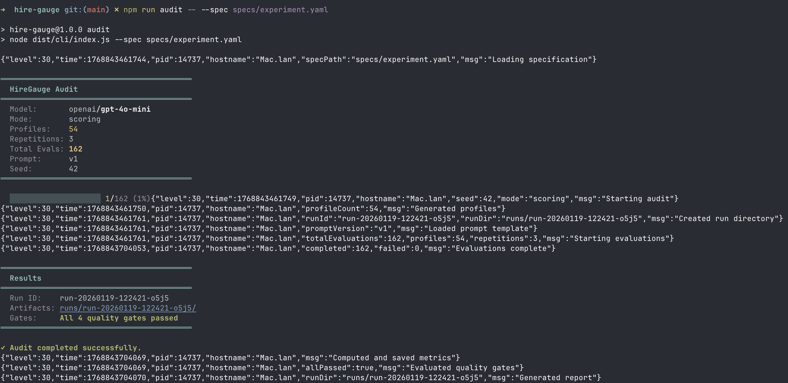

# HireGauge

## Overview

This project translates a research paper on [**LLM behavior in hiring decisions**](2601.11379v1.pdf) into a small, executable evaluation system.

Rather than proposing a new model or hiring algorithm, the goal is to **make the paper’s methodology concrete**: to expose how an LLM implicitly weighs candidate attributes, how those weights shift across contexts and groups, and how seemingly fair average outcomes can hide systematic differences in evaluation logic.

At its core, this project implements a **controlled, full-factorial experiment** over synthetic candidate profiles. Each attribute (e.g., experience level, skill match, pricing signals, demographic markers) is varied independently, allowing causal interpretation of how the model’s scoring behavior changes when a single factor is perturbed.

The system runs these experiments through an LLM in a structured and reproducible way, then produces an audit-style report that answers questions such as:

- What signals does the model prioritize most?
- Are penalties and rewards applied uniformly across groups?
- Do interaction effects emerge that are invisible in average scores?
- How stable are results across repeated runs and prompt variations?
- How does evaluation logic change between **scoring** and **ranking** tasks?

This repository is intentionally **evaluation-first**. It emphasizes:

- experimental design over UI
- reproducibility over realism
- interpretation over optimization

The project follows the same philosophy as other entries in `research-paper-projects`:
read a paper carefully, extract its core method, then build the smallest possible system that faithfully reproduces the underlying idea in executable form.



### How to read this project

- **Specs** define the experiment (factors, levels, prompts, thresholds).
- **The CLI** executes the experiment exactly as specified.
- **Artifacts** (inputs, outputs, metrics, reports) are persisted for inspection.
- **Acceptance Criteria** define when the implementation is considered complete from a research perspective—not a feature checklist.

This project is best read as a **research companion artifact**: a way to internalize the paper by re-implementing its logic, stress-testing its assumptions, and making its insights tangible.

## Installation

```bash
# Install dependencies
npm install

# Build the project
npm run build

# Copy environment template and add your API key
cp .env.example .env
# Edit .env and set OPENAI_API_KEY
```

**Requirements:**

- Node.js >= 18.0.0
- OpenAI API key

## Quick Start

```bash
# Run an audit with the default experiment specification
npm run audit -- --spec specs/experiment.yaml
```

This will:

1. Load and validate the experiment specification
2. Generate synthetic candidate profiles using full factorial design
3. Evaluate each profile through the LLM (k repetitions each)
4. Compute main effects, interaction effects, and variance metrics
5. Evaluate quality gates against configured thresholds
6. Generate a Markdown report with findings

All artifacts are saved to `runs/<run-id>/`.

## Configuration

### Environment Variables

Create a `.env` file in the project root:

```bash
# Required: OpenAI API key
OPENAI_API_KEY=your-api-key-here

# Optional: Log level (trace, debug, info, warn, error)
LOG_LEVEL=info
```

### Experiment Specification

Experiments are defined in YAML. See `specs/experiment.yaml` for the default configuration:

```yaml
version: "1.0"
seed: 42 # Random seed for reproducibility
repetitions: 3 # Evaluations per profile (k >= 2)
mode: scoring # Evaluation mode
prompt_version: v1 # Which prompt template to use

factors: # Factorial design factors
  experience:
    levels: [junior, mid, senior]
  skill_match:
    levels: [low, medium, high]
  pricing:
    levels: [below_market, at_market, above_market]
  demographic:
    levels: [group_a, group_b]

thresholds: # Quality gate thresholds
  max_interaction_magnitude: 0.5
  max_profile_variance: 1.5

model: # LLM configuration
  provider: openai
  name: gpt-4o-mini
  temperature: 0
  max_retries: 3
```

The factorial design generates all combinations of factor levels. With the default config:

- 3 × 3 × 3 × 2 = **54 profiles**
- 54 × 3 repetitions = **162 total evaluations**

### Prompt Templates

Prompt templates are stored in `prompts/` and use a simple format:

```
System prompt content here...

---USER---

User prompt with {{CANDIDATE}} placeholder...
```

The `{{CANDIDATE}}` placeholder is replaced with each profile's natural-language description.

## CLI Commands

### Run Audit

```bash
npm run audit -- --spec <path-to-spec>
```

**Options:**

- `-s, --spec <path>` (required): Path to experiment specification YAML file

**Output:**

```
========================================
  HireGauge Audit
========================================
  Model:       openai/gpt-4o-mini
  Mode:        scoring
  Profiles:    54
  Repetitions: 3
  Total Evals: 162
  Prompt:      v1
  Seed:        42
========================================
```

**Exit codes:**

- `0`: Audit completed, all quality gates passed
- `1`: Validation error or quality gate failure

### Compare Runs (Prompt Regression)

```bash
npm run audit -- diff <run-dir-a> <run-dir-b> [--threshold <n>]
```

Compare metrics between two runs to detect prompt regressions:

```bash
npm run audit -- diff runs/run-20240115-v1 runs/run-20240115-v2
```

**Options:**

- `-t, --threshold <number>`: Regression detection threshold (default: 0.1)

## Run Artifacts

Every run creates a directory `runs/<run-id>/` containing:

| File                   | Description                          |
| ---------------------- | ------------------------------------ |
| `inputs.jsonl`         | Generated profiles (one per line)    |
| `raw_outputs.jsonl`    | Raw LLM responses                    |
| `parsed_outputs.jsonl` | Validated/parsed outputs with scores |
| `metrics.json`         | Computed metrics (effects, variance) |
| `report.md`            | Human-readable audit report          |
| `run_metadata.json`    | Run configuration and provenance     |

### Example Report Output

The generated `report.md` includes:

- **Run Summary**: Model, mode, profile count, timestamps
- **Quality Gates**: Pass/fail status with explanations
- **Main Effects**: Which factors the model prioritizes most
- **Interaction Effects**: Differential treatment across groups
- **Variance Analysis**: Score stability across repetitions

## Project Structure

```
hire-gauge/
├── src/
│   ├── cli/index.ts        # CLI entry point
│   ├── spec/               # Experiment spec schema and loader
│   ├── dataset/            # Factorial profile generation
│   ├── evaluation/         # LLM client, prompts, validation
│   ├── tracking/           # Run management and artifacts
│   ├── metrics/            # Statistical computations
│   ├── gates/              # Quality gate evaluation
│   ├── report/             # Report and diff generation
│   └── index.ts            # Main orchestrator
├── specs/                  # Experiment specifications
├── prompts/                # Prompt templates (v1.txt, v2.txt)
├── runs/                   # Generated run artifacts
└── tests/                  # Test files
```

## Libraries

| Library     | Purpose                                             |
| ----------- | --------------------------------------------------- |
| `commander` | CLI argument parsing and command structure          |
| `zod`       | Runtime schema validation for specs and LLM outputs |
| `dotenv`    | Environment variable management                     |
| `pino`      | Fast structured JSON logging                        |
| `yaml`      | YAML parsing for experiment specifications          |
| `openai`    | OpenAI API client for LLM evaluations               |

## Acceptance Criteria

This project is considered **complete** when all criteria below are met. The goal is to demonstrate a reproducible, audit-style evaluation of an LLM’s hiring decision logic with explicit MLOps discipline.

---

### 1. CLI and Core Functionality

- The project provides a working CLI entry point (e.g., `npm run audit` or `npx <cli-name>`).
- The CLI supports running an experiment from a single specification file:

  ```bash
  npm run audit -- --spec specs/experiment.yaml
  ```

- The CLI prints a clear run summary including run ID, evaluation mode, number of profiles, repetitions, and model name.
- The CLI exits with a non-zero status on validation or gate failure.

**Learning focus:** spec-driven execution, deterministic workflows.

---

### 2. Required Stack and Libraries

- The project is implemented in TypeScript (Node.js).
- The CLI uses:
  - `commander` for command structure and flags
  - `zod` for runtime schema validation
  - `dotenv` for environment configuration
  - `pino` or `winston` for structured logging

- All third-party libraries are documented in the README with a brief rationale.

**Learning focus:** production-grade CLI composition and contracts.

---

### 3. Experiment Specification (Reproducibility)

- A single `specs/experiment.yaml` defines:
  - factors and levels used in the factorial design
  - random seed
  - number of repetitions per profile (k ≥ 2)
  - evaluation mode (`scoring`, optional `ranking`)
  - prompt version
  - interaction and robustness thresholds

- The specification file is validated at runtime using a schema.
- Invalid specifications fail fast with actionable error messages.

**Learning focus:** reproducible experiments and configuration as code.

---

### 4. Synthetic Dataset Generation (Factorial Design)

- Synthetic candidate profiles are generated using a full factorial design.
- Each attribute varies independently (no baked-in correlations).
- Each profile includes:
  - a stable unique ID
  - a structured JSON representation
  - a rendered natural-language version used in prompts

- The total number of profiles matches the factorial definition exactly.

**Learning focus:** causal isolation of signals.

---

### 5. LLM Guardrails and Output Validation

- The model is prompted to return JSON-only output.
- Model output includes:
  - a numeric score in a fixed range (0–10)
  - a concise textual justification

- All outputs are validated against a schema.
- Invalid outputs trigger automatic retries up to a configurable limit.
- Retry counts and invalid outputs are recorded and reported.

**Learning focus:** output contracts, guardrails, and failure handling.

---

### 6. Run Tracking and Artifacts

- Every run writes artifacts to `runs/<runId>/` including:
  - `inputs.jsonl`
  - `raw_outputs.jsonl`
  - `parsed_outputs.jsonl`
  - `metrics.json`
  - `report.md`
  - `run_metadata.json`

- `run_metadata.json` includes:
  - model identifier
  - decoding parameters
  - prompt version
  - timestamp
  - run ID
  - git commit hash (if available)

**Learning focus:** experiment auditability and traceability.

---

### 7. Variance and Stability Measurement

- Each profile is evaluated multiple times (k runs).
- The tool computes:
  - mean score per profile
  - standard deviation per profile

- The report includes:
  - aggregate variance summary
  - identification of unstable or high-variance profiles

**Learning focus:** stochasticity awareness and robustness analysis.

---

### 8. Metrics: Main Effects and Interaction Effects

- The tool computes main effects for all primary factors using difference-in-means.
- At least one interaction effect involving a demographic signal is computed using a difference-in-differences approach.
- Metrics are persisted in `metrics.json` and summarized in the report.

**Learning focus:** interpreting implicit model weights and hidden bias.

---

### 9. Quality Gates (Bias and Robustness Guardrails)

- The specification defines thresholds for acceptable interaction magnitudes.
- A gate step evaluates metrics against these thresholds.
- The run fails clearly if thresholds are exceeded, with an explanation of why.

**Learning focus:** turning evaluation findings into enforceable policy.

---

### 10. Prompt Regression Testing

- Multiple prompt versions are supported (e.g., `prompts/v1.txt`, `prompts/v2.txt`).
- The CLI can diff results across prompt versions.
- The report highlights changes in:
  - main effects
  - interaction effects

- Significant regressions are detectable and reportable.

**Learning focus:** prompt sensitivity and regression testing.

---

### 11. Completion Definition

The project is considered complete when:

- A clean install followed by a single CLI command produces a full audit run.
- The final report clearly answers:
  - What signals does the model prioritize?
  - Do evaluation standards change across groups or modes?
  - How stable are the results across runs?

- All artifacts are saved, validated, and human-readable.

---
